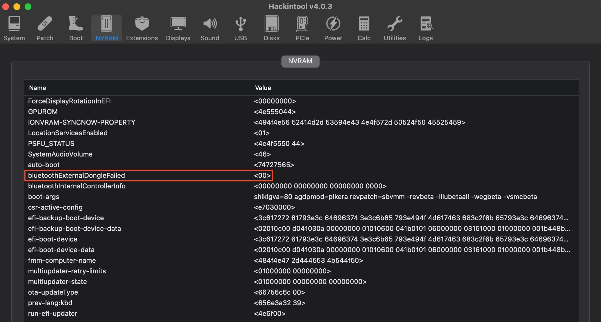

# Intel i7-10700K Gigabyte Z490 VisionG Hackintosh

Fork from https://github.com/samuel21119/Intel-i9-10900-Gigabyte-Z490-Vision-G-Hackintosh

Tested working version: macOS Sequoia 15.1.1

## Updating to Sequoia

https://www.reddit.com/r/hackintosh/comments/1dd2tlq/a_welcome_to_macos_15_sequoia/

> As Apple now polls for more T2-specific information from its Macs, you can't update to Sequoia without either of these fixes:
>
> - Use iMac19,1 SMBIOS to update, then revert to your old SMBIOS if needed
> - Download the latest release of **RestrictEvents.kext, and use it with the boot argument revpatch=sbvmm**.
>
> Note: You may encounter issues with the update not installing if you have BluetoolFixup.kext. Disable it while you are updating and re-enable it afterwards.

## Bootloader

**[OpenCore](https://github.com/acidanthera/OpenCorePkg) 1.0.3**

## Working

- **USB**: All ports working

- **Ethernet**: Intel 82574L 1GbE

  - This NIC is natively supported. However the different subvendor ID prevents the system from loading the driver. So you need to use Linux to flash the EEPROM. Boot into Live Ubuntu. Use ```ip a``` to find out the Ethernet Adapter. In my case, it's ```enp8s0```. Then run the following command:

    ```
    sudo apt install ethtool
    sudo ethtool -E enp8s0 magic 0x10D38086 offset 0x16 value 0x00
    sudo ethtool -E enp8s0 magic 0x10D38086 offset 0x17 value 0x00
    sudo ethtool -E enp8s0 magic 0x10D38086 offset 0x1A value 0xF6
    sudo ethtool -E enp8s0 magic 0x10D38086 offset 0x16 value 0x00
    sudo ethtool -E enp8s0 magic 0x10D38086 offset 0x17 value 0x00
    sudo ethtool -E enp8s0 magic 0x10D38086 offset 0x18 value 0x86
    sudo ethtool -E enp8s0 magic 0x10D38086 offset 0x19 value 0x80
    ```

    Reboot the PC.
    
  
- **Ethernet**: Intel I225-V <br>
  Flash a custom firmware: <br>https://github.com/5T33Z0/Gigabyte-Z490-Vision-G-Hackintosh-OpenCore/blob/main/I225-V_FIX.md <br>
  
  Option 1: Add ```AppleIGC.kext```
  Terminalstrip [pointed me to a new kext](https://github.com/5T33Z0/Gigabyte-Z490-Vision-G-Hackintosh-OpenCore/issues/37) called [AppleIGC](https://github.com/SongXiaoXi/AppleIGC) which is an "Intel 2.5G Ethernet driver for macOS. Based on the Intel igc implementation in Linux". It works on both stock and custom firmware. Verzadil [managed to get it working](https://github.com/5T33Z0/Gigabyte-Z490-Vision-G-Hackintosh-OpenCore/issues/38) with the stock firmware with the following settings:
  
  - Add `AppleIGC.kext` to `EFI/OC/Kexts` and config.plist.
  - Optional: add `e1000=0` to `boot-args` (macOS Monterey+). For Big Sur, use `dk.e1000=0`. I don't need it on my system.
  - In `Kernel/Quirks`, turn on `DisableIoMapper` (might work without it. I need it on my I225-V with custom firmware).
  - Save your config and reboot
  - Run IORegistryExplorer and verify that the kext is servicing the Intel I225-V:
    [](https://user-images.githubusercontent.com/88431749/259463074-b1d3801b-c46d-4250-ac8b-8f5c666698fe.png)
  
  Conditions for Intel I225-V and 3rd party WiFi/LAN cards to work: <br>https://github.com/5T33Z0/Gigabyte-Z490-Vision-G-Hackintosh-OpenCore/blob/main/I225_stock_vs_cstmfw.md <br>
  
  | macOS         | Vt-D   | DisableIoMapper | DMAR (OEM) | DMAR (dropped/replaced) | I225-V / 3rd party LAN/WiFi |
  | ------------- | ------ | --------------- | ---------- | ----------------------- | --------------------------- |
  | 11.4 to 13.3+ | **ON** | **OFF**         | **YES**    | **NO / NO**             | **YES / YES**               |
  
- **Graphics**: Spoof the AMD Radeon RX 5700 XT to the AMD Radeon Pro W5700X via DeviceProperties

  ```
  <key>DeviceProperties</key>
  	<dict>
  		<key>Add</key>
  		<dict>
  			<key>PciRoot(0x0)/Pci(0x1,0x0)/Pci(0x0,0x0)/Pci(0x0,0x0)/Pci(0x0,0x0)</key>
  			<dict>
  				<key>@0,name</key>
  				<string>ATY,Adder</string>
  				<key>@1,name</key>
  				<string>ATY,Adder</string>
  				<key>@2,name</key>
  				<string>ATY,Adder</string>
  				<key>@3,name</key>
  				<string>ATY,Adder</string>
  				<key>AAPL00,DualLink</key>
  				<data>
  				AQAAAA==
  				</data>
  				<key>ATY,Card#</key>
  				<string>102-D32200-00</string>
  				<key>ATY,Copyright</key>
  				<string>Copyright AMD Inc. All Rights Reserved. 2005-2019</string>
  				<key>ATY,DeviceName</key>
  				<string>W5700X</string>
  				<key>ATY,EFIVersion</key>
  				<string>01.01.190</string>
  				<key>ATY,FamilyName</key>
  				<string>Radeon Pro</string>
  				<key>ATY,Rom#</key>
  				<string>113-D3220E-190</string>
  				<key>CAIL_EnableLBPWSupport</key>
  				<integer>0</integer>
  				<key>CAIL_EnableMaxPlayloadSizeSync</key>
  				<integer>1</integer>
  				<key>CFG_CAA</key>
  				<integer>0</integer>
  				<key>CFG_FB_LIMIT</key>
  				<integer>0</integer>
  				<key>CFG_FORCE_MAX_DPS</key>
  				<integer>1</integer>
  				<key>CFG_GEN_FLAGS</key>
  				<integer>0</integer>
  				<key>CFG_NO_MST</key>
  				<integer>0</integer>
  				<key>CFG_NVV</key>
  				<integer>2</integer>
  				<key>CFG_PAA</key>
  				<integer>0</integer>
  				<key>CFG_PULSE_INT</key>
  				<integer>1</integer>
  				<key>CFG_TPS1S</key>
  				<integer>1</integer>
  				<key>CFG_TRANS_WSRV</key>
  				<integer>1</integer>
  				<key>CFG_UFL_CHK</key>
  				<integer>0</integer>
  				<key>CFG_UFL_STP</key>
  				<integer>0</integer>
  				<key>CFG_USE_AGDC</key>
  				<integer>1</integer>
  				<key>CFG_USE_CP2</key>
  				<integer>1</integer>
  				<key>CFG_USE_CPSTATUS</key>
  				<integer>1</integer>
  				<key>CFG_USE_DPT</key>
  				<integer>1</integer>
  				<key>CFG_USE_FBC</key>
  				<integer>0</integer>
  				<key>CFG_USE_FBWRKLP</key>
  				<integer>1</integer>
  				<key>CFG_USE_FEDS</key>
  				<integer>1</integer>
  				<key>CFG_USE_LPT</key>
  				<integer>1</integer>
  				<key>CFG_USE_PSR</key>
  				<integer>0</integer>
  				<key>CFG_USE_SCANOUT</key>
  				<integer>1</integer>
  				<key>CFG_USE_SRRB</key>
  				<integer>0</integer>
  				<key>CFG_USE_STUTTER</key>
  				<integer>1</integer>
  				<key>CFG_USE_TCON</key>
  				<integer>1</integer>
  				<key>PP_DisableDIDT</key>
  				<integer>1</integer>
  				<key>PP_DisablePowerContainment</key>
  				<integer>1</integer>
  				<key>PP_DisableVoltageIsland</key>
  				<integer>0</integer>
  				<key>PP_FuzzyFanControl</key>
  				<integer>1</integer>
  				<key>device_type</key>
  				<string>ATY,AdderParent</string>
  				<key>hda-gfx</key>
  				<string>onboard-1</string>
  				<key>model</key>
  				<string>Radeon Pro W5700X</string>
  				<key>name</key>
  				<string>ATY_GPU</string>
  			</dict>
  		</dict>
  	</dict>
  ```

  


- **Bluetooth**: IOGEAR Bluetooth Dongle

  - Download latest BrcmPatchRAM from https://github.com/acidanthera/BrcmPatchRAM

  - Load 3 kexts in config.plist in the following order: BcrmFirmwareData should be first, BcrmPatchRAM3 second and finally BlueToolFixup third.

  - macOS Sequoia: https://www.tonymacx86.com/threads/sequoia-usb-bluetooth.330275/
    Add `-revbeta -lilubetaall -wegbeta -vsmcbeta` to NVRAM -> Add -> boot-args
    

  - Add the following to NVRAM -> Add -> 7C436110-AB2A-4BBB-A880-FE41995C9F82 above boot-args to set ```bluetoothExternalDongleFailed``` to 00 and ```bluetoothInternalControllerInfo``` to 14 bytes of 0
    
    ```yaml
            <key>bluetoothExternalDongleFailed</key>
            <data>
            AA==
            </data>
            <key>bluetoothInternalControllerInfo</key>
            <data>
            AAAAAAAAAAAAAAAAAAA=
            </data>
    ```
    
  - Use Hackintool to verify that `bluetoothExternalDongleFailed` is <00>
    

- OTA: Add `revpatch=sbvmm` to `boot-args`  to force VMM SB model, allowing OTA updates for unsupported models on macOS 11.3 or newer.

- Native NVRAM

- Sleep/Wake

- Reboot/Shutdown

## BIOS Setting

- Disable

  - CSM Support
  - Secure Boot
  - Re-Size BAR Support
  - Settings -> Super IO Configuration -> Serial Port: Disabled

- Enable

  - VT-x

  - VT-d (**DisableIoMapper** OFF/NO/FALSE in config.plist Kernel/Quirks)

  - Above 4G Decoding

  - Internal Graphics

  - DVMT Pre-Allocated: 64M

  - Hyper-Threading

    

## Credits

- [Apple](https://www.apple.com/) : Awesome macOS
- [Acidanthera](https://github.com/acidanthera) : OpencorePkg, kexts, tools etc.
- [Dortania](https://github.com/dortania) : Opencore guide
- https://github.com/SchmockLord/Hackintosh-Intel-i9-10900k-Gigabyte-Z490-Vision-D
- https://dortania.github.io/OpenCore-Install-Guide/extras/monterey.html#bluetooth: Bluetooth
- https://github.com/acidanthera/BrcmPatchRAM: Bluetooth
- https://www.reddit.com/r/hackintosh/comments/qgshzj/bluetooth_on_macos_monterey_1201/: IOGEAR Bluetooth dongle
- https://dortania.github.io/OpenCore-Install-Guide/ktext.html#ethernet: Vendor Id of Intel 82574L
- https://github.com/BrushXue/EP2C602-4LD16-E5-2667v2-Hackintosh: Intel 82574L Ethernet Adapter
- https://www.tonymacx86.com/threads/guide-asrock-rack-ep2c602.289060/: Intel 82574 Ethernet Adapter
- https://www.tonymacx86.com/threads/guide-replace-non-working-intel-i225-with-82574l-pcie-nic-monterey-opencore.319056/: Replace non-working Intel I225 with 82574L PCIe NIC (Monterey + OpenCore)
- https://www.tonymacx86.com/threads/solved-intel-82574l-nic-make-it-work-again.322802/: Intel 82574L PCIe NIC on Ventura
- https://www.tonymacx86.com/threads/asus-z690-proart-creator-wifi-thunderbolt-4-i7-12700k-amd-rx-6800-xt.318311/page-79#post-2313032: Spoof the AMD Radeon RX 5700 XT to the AMD Radeon Pro W5700X via DeviceProperties
- https://github.com/osx86-ijb/amdradeonrx5700xt-macos-fix-spoof: Spoof the AMD Radeon RX 5700 XT to the AMD Radeon Pro W5700X via DevicePropertie
- https://github.com/5T33Z0/Gigabyte-Z490-Vision-G-Hackintosh-OpenCore: I225-V Fix
- https://github.com/acidanthera/RestrictEvents